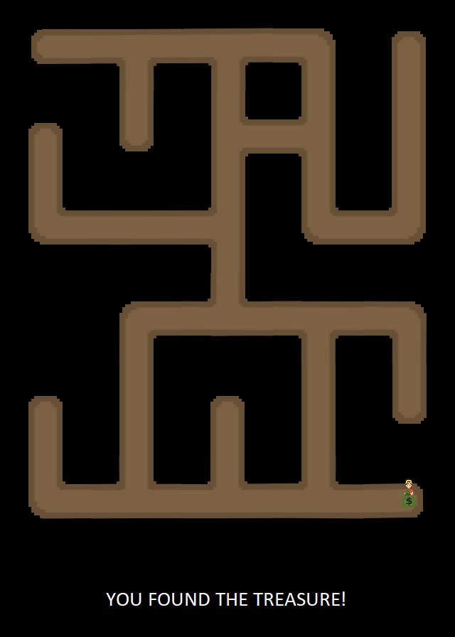

# Cave Explorer

*Cave Explorer* is *Jia Zheng*'s implementation of [*Cave Explorer*](http://graphics.cs.cmu.edu/courses/15-466-f17/game1-designs/aluo/) for game1 in 15-466-f17.



## Asset Pipeline

The assets for this game were created using [Piskel](http://www.piskelapp.com/), based on the pictures given in the design document. They were then combined into a spritesheet and exported into an image. 

## Architecture

We initialised all tiles in the map and the valid directions that a player can moved when situated on the tiles. The map tiles are mostly are all hardcoded.

The game loop detects keyboard events and react accordingly.

## Reflection

Originally the intention was to extend the design document so that the map can also be generated randomly. To do so, we had to be able to validate the placement of the tiles, as well as ensure that the map spans the entire 6 by 5 grid. This was deem to be too complicated to implement due to time constraints.

Also, the initial implementation was to remove tiles (sprites) but the general implementation draws the sprites every single time the state is updated.

Additionally, in the design document, it was stated that the map was a 6 by 5 grid when it was in fact a 5 by 6 grid. This was slightly confusing when first trying to generate assets for the game as I was unsure of how the map should be dissected.

# About Base1

This game is based on Base1, starter code for game1 in the 15-466-f17 course. It was developed by Jim McCann, and is released into the public domain.

## Requirements

 - modern C++ compiler
 - glm
 - libSDL2
 - libpng

On Linux or OSX these requirements should be available from your package manager without too much hassle.

## Building

This code has been set up to be built with [FT jam](https://www.freetype.org/jam/).

### Getting Jam

For more information on Jam, see the [Jam Documentation](https://www.perforce.com/documentation/jam-documentation) page at Perforce, which includes both reference documentation and a getting started guide.

On unixish OSs, Jam is available from your package manager:
```
	brew install ftjam #on OSX
	apt get ftjam #on Debian-ish Linux
```

On Windows, you can get a binary [from sourceforge](https://sourceforge.net/projects/freetype/files/ftjam/2.5.2/ftjam-2.5.2-win32.zip/download),
and put it somewhere in your `%PATH%`.
(Possibly: also set the `JAM_TOOLSET` variable to `VISUALC`.)

### Bulding
Open a terminal (on windows, a Visual Studio Command Prompt), change to this directory, and type:
```
	jam
```

### Building (local libs)

Depending on your OSX, clone 
[kit-libs-linux](https://github.com/ixchow/kit-libs-linux),
[kit-libs-osx](https://github.com/ixchow/kit-libs-osx),
or [kit-libs-win](https://github.com/ixchow/kit-libs-win)
as a subdirectory of the current directory.

The Jamfile sets up library and header search paths such that local libraries will be preferred over system libraries.
